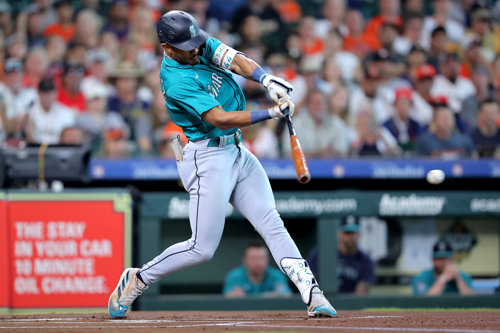

---
project:
  type: default

title: "Fuego o no fuego: Detecting a performance streak of an MLB player using Hidden Markov Models"
author: "Juan Ángel Pérez Córcoles"

format:
  html:
    theme: journal
    code-fold: true
    code-tools: true
    toc: true
    embed-resources: true
    output-file: "index.html" 

---

## Introduction

Julio Rodríguez is considered one of the most promising young players in Major League Baseball (MLB). He was ranked as the best player at his position (Center Fielder) for the upcoming MLB season and 16th overall by mlb.com. However, media and fans alike claim that Julio usually underperforms during the first half of the season and then explodes in the second half. The question is: Is there any truth to this claim? Or is it just a case of confirmation bias?



To answer this question, we will use Hidden Markov Models (HMMs) to analyze Julio's performance data and detect any potential performance streaks. We will use xwOBA (expected weighted On-Base Average) as our performance metric, which is a comprehensive statistic that accounts for a player's ability to get on base and hit for power.

The difference between wOBA and xwOBA is that wOBA is based on the actual outcomes of plate appearances (e.g., walks, singles, doubles, etc.), while xwOBA is based on the expected outcomes derived from the quality of contact (e.g., launch speed and angle). This means that xwOBA can provide a more nuanced view of a player's performance by accounting for the underlying quality of their batted balls, rather than just the results.

The expected weighted on-base average (xwOBA) is defined as:
$$
xwOBA = \frac{w_{BB} \cdot BB + w_{HBP} \cdot HBP + w_{1B} \cdot 1B + w_{2B} \cdot 2B + w_{3B} \cdot 3B + w_{HR} \cdot HR}{AB + BB - IBB + SF + HBP}
$$

## Data

The data was sourced using the `baseballr` package, which retrieves data from Baseball Savant (https://baseballsavant.mlb.com/). We take plate appearance that Julio Rodríguez has had in his whole career, unfortunately the `baseballr`package fails a lot of times while trying to use it, so we employ the url where all the data is stored.

```{r}
#| output: false
library(baseballr)
library(readr)
library(dplyr)
library(tidyverse)
library(depmixS4)
library(zoo)
library(forcats)
library(moments)
library(DescTools)
library(ggplot2)
library(tidyr)
library(ggtext)
library(knitr)

seasons = c(2022, 2023, 2024, 2025)  

fetch_season_data = function(season) {
  url = paste0(
    'https://baseballsavant.mlb.com/statcast_search/csv?all=true',
    '&hfGT=R%7C&hfSea=', season, '%7C&player_type=batter',
    '&batters_lookup%5B%5D=677594&min_pitches=0&min_results=0',
    '&group_by=name&sort_col=pitches&player_event_sort=h_launch_speed',
    '&sort_order=desc&min_abs=0&type=details'
  )
  
  message("Fetching season: ", season)
  
  tryCatch({
    # Use read_csv and define the na strings explicitly
    df = read_csv(url, na = c("", "NA", "null"), show_col_types = FALSE)
    df$season = season
    return(df)
  }, error = function(e) {
    warning("Failed to fetch season ", season, ": ", e$message)
    return(NULL)
  })
}

all_seasons_list = lapply(seasons, fetch_season_data)
data_raw = bind_rows(Filter(Negate(is.null), all_seasons_list))


jrod_data = data_raw %>% 
  dplyr::select(
    game_date,
    season,
    events,
    launch_speed,
    launch_angle,
    estimated_ba_using_speedangle,
    estimated_woba_using_speedangle,
    bb_type
  )

jrod_data = jrod_data %>% 
  # Filter out mid-at-bat pitches, but KEEP all plate appearance enders
  filter(!is.na(events)) %>% 
  mutate(
    game_date = as.Date(game_date),
    events = as.factor(events),
    bb_type = as.factor(bb_type),
    
    # Create the continuous sequence metric
    xwoba_continuous = case_when(
      # 1. If he hit the ball, use the Statcast speed/angle estimate
      !is.na(estimated_woba_using_speedangle) ~ estimated_woba_using_speedangle,
      
      # 2. Strikeouts are worth zero
      events %in% c("strikeout", "strikeout_double_play") ~ 0.00,
      
      # 3. Walks are positive outcomes
      events %in% c("walk", "intentional_walk") ~ 0.69,
      
      # 4. Hit-by-pitch is slightly more valuable than a walk in wOBA
      events == "hit_by_pitch" ~ 0.72,
      
      # 5. Catch-all for rare non-contact outs (e.g., caught stealing, pickoffs, etc.)
      TRUE ~ 0.00 
    )


  )
# At bat level data with PA index and season day

jrod_ab = jrod_data %>%
  arrange(game_date) %>%
  group_by(season, game_date) %>%
  mutate(pa_index = row_number()) %>%
  ungroup() %>%
  arrange(season, game_date, pa_index) %>%
  mutate(
    pa_id = row_number(),  
    season_day = as.numeric(game_date - as.Date(paste0(season, "-04-01")))
  )
```

From all the variables we have the most important one is `estimated_woba_using_speedangle`, which is the xwOBA. This variable gives us a good indication of how well Julio Rodríguez is performing in terms of his ability to get on base and hit for power. 

However this variable is only available for plate appearances where Julio made contact with the ball. For plate appearances where he did not make contact (e.g., strikeouts, walks, hit-by-pitch), we will need to assign a xwOBA value based on the type of outcome. 

To assess this problem, we create a new variable called `xwoba_continuous` which assigns fixed weights to different types of outcomes. For example, strikeouts are assigned a value of 0.00, walks are assigned a value of 0.69, and hit-by-pitch is assigned a value of 0.72 (this values were assigned based on historical data). This way we can have a continuous metric that captures the overall performance of Julio Rodríguez across all plate appearances, not just those where he made contact with the ball. 

## Rolling HMM Fit

Because we want to measure a streak and not only individual plates appearances, we need to use a rolling average of xwOBA as the input for our HMM. This will help us smooth out the noise and capture the underlying performance trends over time. We will use a 25-PA (plate appearance) rolling average, which is a common choice in baseball analytics for capturing short-term performance trends while still providing enough data points for the model to learn from. We use 25 because a player will usually have around 4-5 plate appearances per game, so a 25-PA rolling average will capture performance over approximately 5-6 games, which is a reasonable window for detecting streaks without being too short-term or too long-term focused.

```{r}
#| warning: false
#| message: false
#| output: FALSE


# Calculate a 25-PA rolling average of xwOBA
jrod_ab = jrod_ab %>%
  group_by(season) %>%
  arrange(pa_id) %>%
  mutate(
    xwoba_roll25 = rollmean(xwoba_continuous, k = 25, fill = NA, align = "right")
  ) %>%
  ungroup()

# HMMs cannot handle NA values, which will appear in the first 24 PAs of each season 
# due to the rolling window. We will filter them out for the model.
jrod_hmm_data = jrod_ab %>% filter(!is.na(xwoba_roll25))

# Recalculate plate appearances per season for the trimmed dataset
pa_counts_roll = jrod_hmm_data %>%
  group_by(season) %>%
  summarise(n = n(), .groups = "drop") %>%
  pull(n)
```

## Pre HMM Diagnostics

In order to establish a proper HMM model, we need to check the distribution of our input variable (the rolling xwOBA) to see if it meets the assumptions of the model. HMMs typically assume that the observations are generated from a mixture of distributions (e.g., Gaussian), so we need to check for normality, skewness, and the presence of outliers in our rolling xwOBA data.

But we have a problem, xwOBA tends to have a lot of 0 values because of strikeouts which can violate the normality assumption of the HMM. Fortunately, the Central Limit Theorem comes to the rescue here, as the rolling average of xwOBA will be less skewed and more normally distributed than the raw xwOBA values. However, we will still check the distribution of both the raw and rolling xwOBA to confirm this.

```{r}
#| warning: false
#| message: false
#|output: FALSE
set.seed(119)
par(mfrow = c(1, 3))
hist(jrod_ab$xwoba_continuous,
     breaks = 40, main = "xwOBA raw", xlab = "xwOBA",
     col = "steelblue", border = "white")
abline(v = median(jrod_ab$xwoba_continuous, na.rm = TRUE), col = "green", lwd = 2)
abline(v = mean(jrod_ab$xwoba_continuous, na.rm = TRUE),   col = "orange", lwd = 2)
legend("topright", c("Median", "Mean"), col = c("green", "orange"), lwd = 2, cex = 0.7)

# Square-root transform (preserves zeros, reduces right skew)
hist(sqrt(jrod_ab$xwoba_continuous),
     breaks = 40, main = "xwOBA sqrt-transformed", xlab = "sqrt(xwOBA)",
     col = "steelblue", border = "white")

# QQ plot of raw
qqnorm(jrod_ab$xwoba_continuous, main = "QQ plot — raw xwOBA")
qqline(jrod_ab$xwoba_continuous, col = "red")

par(mfrow = c(1, 1))


par(mfrow = c(1, 2))

hist(jrod_hmm_data$xwoba_roll25,
     breaks = 40, main = "25-PA Rolling xwOBA", xlab = "xwOBA",
     col = "steelblue", border = "white")

qqnorm(jrod_hmm_data$xwoba_roll25, main = "QQ plot — Rolling xwOBA")
qqline(jrod_hmm_data$xwoba_roll25, col = "red")

par(mfrow = c(1, 1))

shapiro.test(sample(jrod_hmm_data$xwoba_roll25, 500))
```

As we predicted, the Central Limit Theorem comes to the rescue here, as the rolling xwOBA is much less skewed and more normally distributed than the raw xwOBA values. The histogram of the rolling xwOBA shows a more bell-shaped distribution, and the QQ plot indicates that the rolling xwOBA points are closer to the normal line compared to the raw xwOBA. We also compute a Shapiro-Wilk test to test the normality.

## Model Selection (AIC/BIC)

Now we have to define which states we should use for our HMM. We will try models with 2 to 5 states and compare their AIC and BIC values to find the best fit.

```{r}
#| warning: false
#| message: false
#| output: FALSE

n_states_to_try = 2:5

model_selection_results = map_dfr(n_states_to_try, function(k) {
  hmm_k = depmix(xwoba_roll25 ~ 1, 
                 data    = jrod_hmm_data, 
                 nstates = k, 
                 family  = gaussian(), 
                 ntimes  = pa_counts_roll)
  
  fit_k = tryCatch(
    fit(hmm_k, verbose = FALSE),
    error = function(e) NULL
  )
  
  if (is.null(fit_k)) {
    return(tibble(states = k, logLik = NA, AIC = NA, BIC = NA))
  }
  
  tibble(
    states = k,
    logLik = as.numeric(logLik(fit_k)),
    AIC    = AIC(fit_k),
    BIC    = BIC(fit_k)
  )
})

print(model_selection_results)

# Plot it
model_selection_results %>%
  pivot_longer(cols = c(AIC, BIC), names_to = "metric", values_to = "value") %>%
  ggplot(aes(x = states, y = value, color = metric)) +
  geom_line(linewidth = 1) +
  geom_point(size = 3) +
  geom_vline(xintercept = 3, linetype = "dashed", color = "gray40") +
  annotate("text", x = 3.1, y = max(model_selection_results$AIC, na.rm = TRUE), 
           label = "Your choice", hjust = 0, color = "gray40", size = 3.5) +
  scale_color_manual(values = c("AIC" = "#de2d26", "BIC" = "#3182bd")) +
  theme_minimal() +
  labs(
    title = "HMM Model Selection: AIC & BIC by Number of States",
    x     = "Number of Hidden States",
    y     = "Information Criterion",
    color = "Metric"
  ) +
  theme(plot.title = element_text(face = "bold", size = 14))
```

We observe that the AIC and the BIC keep lowering but we see the biggest drop from 2 to 3 states, and then the improvement is marginal. This suggests that a 3-state model is a good balance between model fit and complexity for our data. Therefore, we will proceed with fitting a 3-state HMM to our rolling xwOBA data.

## HMM Fit 

We then fit the HMM model with the chosen number of states (3) to our rolling xwOBA data. After fitting the model, we will use the Viterbi algorithm to decode the most likely sequence of hidden states for each plate appearance in our dataset.

```{r}
#| warning: false
#| message: false
#| output: FALSE

# Fit a 3-state HMM on the rolling average
hmm_roll = depmix(xwoba_roll25 ~ 1, data = jrod_hmm_data, nstates = 3, family = gaussian(), ntimes = pa_counts_roll)
fit_roll = fit(hmm_roll, verbose = FALSE)

# Decode the states
jrod_hmm_data$state_roll = viterbi(fit_roll)$state
```

## Dynamic State Mapping

After fitting our HMM model, we have assigned each plate appearance to one of three hidden states (state_roll). However, these states are currently labeled as 1, 2, and 3, which doesn't provide any intuitive understanding of what they represent in terms of performance. To make the states more interpretable, we will calculate the mean rolling xwOBA for each state and assign labels dynamically based on their performance levels. We will label the states as "Cold", "Average", and "Hot" based on their mean rolling xwOBA values, with "Cold" representing the lowest mean xwOBA, "Average" representing the middle mean xwOBA, and "Hot" representing the highest mean xwOBA. This way, we can easily understand the performance level associated with each state when we visualize the results later on.

```{r}
#| warning: false
#| message: false
#| output: FALSE

# 1. Find the mean rolling xwOBA for each state and assign labels dynamically
state_mapping = jrod_hmm_data %>%
  group_by(state_roll) %>%
  summarize(mean_val = mean(xwoba_roll25, na.rm = TRUE)) %>%
  arrange(mean_val) %>%
  mutate(state_name = c("Cold", "Average", "Hot")) 

# 2. Delete the old state_name column from the dataset to prevent a collision
jrod_hmm_data$state_name = NULL

# 3. Join the new labels back to the main dataset
jrod_hmm_data = jrod_hmm_data %>%
  left_join(state_mapping %>% dplyr::select(state_roll, state_name), by = "state_roll") %>%
  mutate(state_name = factor(state_name, levels = c("Cold", "Average", "Hot")))
```

## Streak Visualization

Finally we plot the rolling xwOBA over time, coloring the points by their assigned HMM state. This will allow us to visually identify any performance streaks that Julio Rodríguez may have had during the seasons. We will create separate plots for each season to see if there are any seasonal patterns in his performance.


```{r}

for (yr in c(2022, 2023, 2024, 2025)) {
  p = jrod_hmm_data %>%
    filter(season == yr) %>%
    ggplot(aes(x = game_date, y = xwoba_roll25, color = state_name)) +
    geom_line(aes(group = 1), color = "gray50", alpha = 0.4, linewidth = 0.8) +
    geom_point(alpha = 0.8, size = 2) +
    scale_color_manual(values = c("Cold" = "#3182bd", "Average" = "#bdbdbd", "Hot" = "#de2d26")) +
    theme_minimal() +
    labs(
      title = paste("Julio Rodríguez: True Performance Streaks (", yr, ")"),
      subtitle = "3-State HMM applied to a 25-PA Rolling xwOBA",
      x = "Game Date",
      y = "25-PA Rolling xwOBA",
      color = "HMM State"
    ) +
    theme(plot.title = element_text(face = "bold", size = 14), legend.position = "bottom")
  
  print(p)
}
```

The plots give us a clear picture of the streak patterns of Julio Rodríguez across the seasons. In the 2022 season this pattern is clear, we can see that from april to mid june Julio's performance is mostly in the "Cold" state, then we see a huge increase in performance in mid june which lasts till mid july and at the end of the season the performance is maintained.

In 2023, the pattern is even more clear, we see a long "Cold" streak from april to july and then Julio start performing incredibly well from july to the end of the season, with a long "Hot" streak.

In 2024, we can see this "Cold" pattern only lasting the first month of the season and then Julio starts performing well from the beginning of the season, with a long "Hot" streak from may to the end of the season.

In 2025, Julio doesn't have that bad of a start to the season but we can see that after July, his performance is almost MVP level with an xwOBA reaching almost 0.600 in some games.

## Conclusion

Our study shows that the claims that Julio usually has a slow start of the season and then explodes in the second half are indeed supported by the data. The HMM analysis revealed distinct performance states that align with the narrative of a "Cold" start followed by a "Hot" streak in the later part of the season. This pattern is consistent across multiple seasons, suggesting that it is not just a case of confirmation bias but rather a real phenomenon in Julio Rodríguez's performance.

